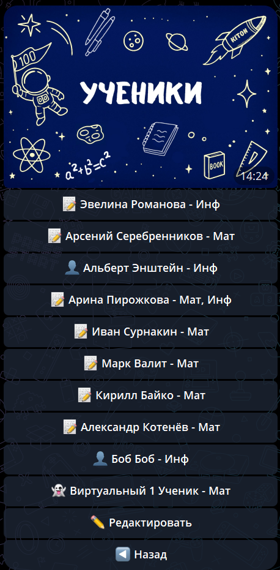

# Дети

В разделе **«Дети»** отображается список всех подключённых детей.

---

## Подключение ребёнка

1. Попросите ребёнка открыть **👤 Профиль** в боте
2. Он скопирует персональный код (например, `ABCD-1234-EFGH`)
3. В главном меню нажмите **➕ Добавить ученика**
4. Введите код ребёнка
5. Готово! Вы оба получите уведомления

**💡 Важно:** Можно подключить несколько детей — все будут видны в одном меню.

---

## Отсоединение ребёнка

1. Откройте раздел **👥 Дети**
2. Выберите нужного ребёнка
3. Нажмите кнопку отсоединения

**⚠️ Важно:** После отсоединения вы перестанете получать уведомления о занятиях и заданиях этого ребёнка.

---

## Что видно в списке?

- Имя и фамилия каждого ребёнка
- Количество активных домашних заданий
- Информация о репетиторах

*По карточкам удобно понять, кто подключён и где есть активные задания.*

💡 **Совет:** Регулярно проверяйте раздел, чтобы быть в курсе всех подключённых репетиторов.
