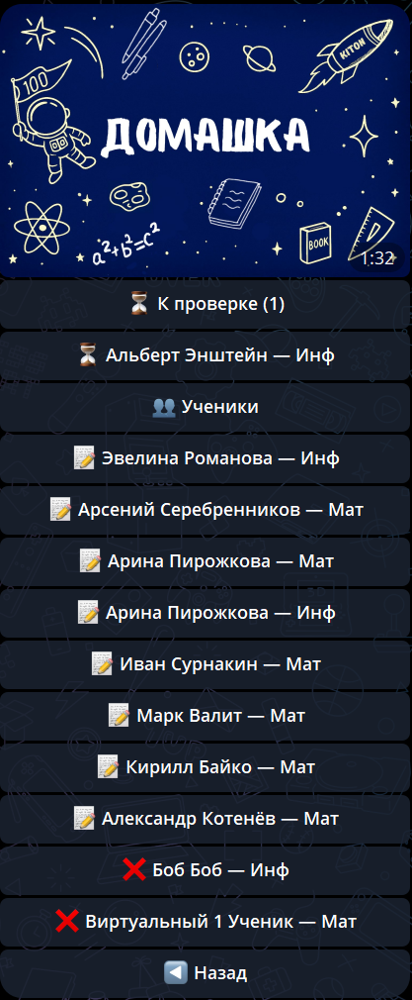

# Домашние задания

В разделе **«Домашние задания»** вы видите полную доступную историю заданий детей от подключённых репетиторов.

Статусы помогают быстро понять, что ребёнку задано, что уже сдано и что проверено репетитором.

---

## Просмотр заданий

1. В меню выберите **📚 Домашние задания**
2. Увидите список заданий, сгруппированных по детям и репетиторам. В Telegram и VK длинная история открывается постранично.
3. Для каждого задания видно:
    - Текст задания
    - Репетитор и предмет
    - Статус задания
    - Ответ и файлы ребёнка
    - Оценка и публичный комментарий репетитора (если проверено)
    - Выданные материалы

В групповом ДЗ сначала показано общее задание группы, затем личная сдача вашего ребёнка. Работы других учеников родителю недоступны.

---

## Статусы заданий

- **📝** — задано, ожидает выполнения
- **⏳** — сдано, ожидает проверки
- **✅** — проверено, есть оценка и Газики

---

## 🔔 Уведомления

Вы получаете уведомления:

- При создании нового задания для ребёнка
- При проверке задания (с оценкой и Газиками)
- При изменении задания репетитором, если эта категория включена

**💡 Важно:** Уведомления приходят только если вы подключены к ребёнку.

---

## Просмотр файлов

Файлы задания, работа ребёнка и выданные материалы находятся внутри карточки ДЗ. Объёмные файлы в Telegram и VK открываются по защищённой ссылке на веб-кабинет. Общая база знаний репетитора родителю недоступна.

---

## ⚠️ Важно

1. Вы можете только просматривать задания - сдавать и изменять решение должен сам ребёнок
2. Если детей несколько, задания от каждого отображаются отдельно
3. История всех заданий сохраняется и доступна для просмотра
