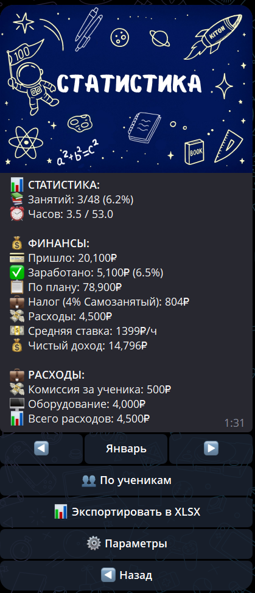

# Прогресс

В разделе **«Прогресс»** вы видите статистику обучения ребёнка.

Прогресс стоит смотреть по динамике: регулярность ДЗ, средний результат и Газики за несколько занятий говорят больше, чем одна оценка.

---

## Что отображается?

- **📝 ДЗ выдано** — сколько заданий получил ребёнок
- **📬 ДЗ выполнено** — сколько заданий проверено
- **⭐️ Средний балл по ДЗ** — средняя оценка за проверенные задания
- **📅 Посещаемость** — доля проведённых занятий
- **📈 Динамика** — изменение показателей за выбранный период
- **🏆 Газики** — накопленные баллы, если репетитор использует эту систему

---

## Как посмотреть?

1. В меню выберите **📈 Прогресс**.
2. Вы увидите сводную статистику по подключённым детям.

**Важно:** Данные показываются **по каждому ребёнку и доступу репетитора отдельно**. Показатели другого репетитора не смешиваются с текущей связью.

---

## Что такое Газики?

**Газики** — бонусные баллы за выполнение заданий (от 0 до 50 за задание). Чем качественнее выполнение, тем больше Газиков.

**Что можно обменять:**

- 🎫 Скидка 10% на занятие (400 Газиков)
- 🎫 Скидка 50% на занятие (600 Газиков)
- 🆓 Бесплатное занятие (1000 Газиков)

---

## ⚠️ Важно

1. Статистика обновляется автоматически после проверки каждого задания
2. Средний балл считается только по проверенным заданиям
3. Газики показываются только там, где репетитор включил эту систему

---

💡 **Совет:** Регулярно проверяйте прогресс, чтобы отслеживать успеваемость и мотивировать ребёнка на выполнение заданий.
