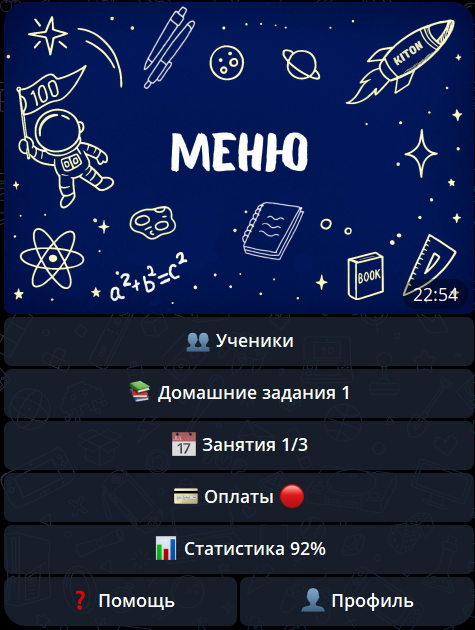

# 👨‍🏫 KITON — Платформа для репетиторов

**KITON** — это профессиональная экосистема для автоматизации работы репетитора: от первого касания с учеником до детальной финансовой отчётности. Бот объединяет преподавателя, ученика и его родителей в едином информационном поле, обеспечивая прозрачность учебного процесса и повышая мотивацию через геймификацию.

---

## 🚀 Старт работы с платформой

### 1. Регистрация и первичная настройка

1. Откройте бота [KITON](http://t.me/tutor_auto_bot) в Telegram по [@tutor_auto_bot](http://t.me/tutor_auto_bot) и нажмите «Запустить» или `/start`.
2. Выберите роль «Репетитор», заполните профиль (ФИО, предметы, контактные данные).
3. По кнопке или команде `/menu` вы окажетесь в главном меню сервиса.

### 2. Подключение первого ученика

В боте есть **3 способа добавления ученика:**

---

### 1. 🔗 Подключение по ссылке (рекомендуется)

Самый простой и быстрый способ.

1. В меню выберите `Ученики → Добавить ученика / Редактировать → По ссылке`.
2. Бот создаст **виртуального ученика** и выдаст персональную ссылку.
3. Отправьте эту ссылку ученику.
4. Ученик перейдёт по ссылке:
    - Если ученик **ещё не зарегистрирован** — он регистрируется в боте
    - Если ученик **уже зарегистрирован** — он может использовать ссылку, виртуальный ученик автоматически заменится на реального
5. После регистрации или использования ссылки ученик **автоматически становится реальным** и подключается к вам.

👉 Ничего вручную подтверждать не нужно. Ссылка работает и для новых, и для уже зарегистрированных учеников.

---

### 2. 🔑 Подключение по коду (если ученик уже в боте)

Подходит, если ученик **уже зарегистрирован** в Telegram-боте.

1. Попросите ученика отправить вам персональный код (например, `ABCD-1234-EFGH`). Код находится в разделе Профиль.
2. В меню выберите `Ученики → Добавить ученика / Редактировать → По коду`.
3. Введите код — ученик подключится сразу как реальный.

---

### 3. 👻 Создание виртуального ученика (**или у вас нет его Telegram**)

Используется, если ученик **ещё не зарегистрирован** или вы хотите вести учёт независимо от ученика.

1. В меню выберите `Ученики → Добавить ученика / Редактировать → Виртуальный ученик`.
2. Вы можете вести занятия, задания, оплаты и статистику.
3. Когда ученик зарегистрируется в Telegram:
    - попросите его отправить персональный код
    - выберите виртуального ученика
    - нажмите кнопку `Подключить реального ученика`
    - виртуальный профиль будет заменён на реальный (все данные сохранятся).

---

После подключения первого ученика становятся доступны все функции: **[расписание](Занятия.md), [задания](Домашние_задания.md), [оплаты](Оплаты.md), [статистика](Статистика.md) и балльная система «Газики»**.

---

## 📋 Главное меню и его индикаторы

Обращайте внимание на индикаторы рядом с кнопками:

| Кнопка | Что внутри | Индикаторы |
| :--- | :--- | :--- |
| **👥 Ученики** | Список учеников, карточки, расписание. | `📝` — активное ДЗ, `👤` — реальный, `👻` — виртуальный |
| **📚 ДЗ** | Проверка решений, выставление баллов, архив. | ⏳ Число непроверенных работ |
| **📅 Занятия** | Календарь, создание уроков, расписание. | 🔢 Количество уроков на сегодня |
| **💰 Оплаты** | Учёт платежей, баланс, напоминания. | 🔴 Красный при наличии долгов |
| **📊 Статистика** | Аналитика доходов, расходов и прогноз. | 📈 % выполнения плана уроков |
| **👤 Профиль** | Тарифы, партнёрка, настройки договора. | 🔥 NEW! (акции и бонусы) |

---

## ☘️ Изучите работу всех кнопок

[**Ученики**](Ученики.md)

[**Домашние задания**](Домашние_задания.md)

[**Занятия**](Занятия.md)

[**Оплаты**](Оплаты.md)

[**Статистика**](Статистика.md)

[**Профиль**](Профиль.md)

[**Газики**](Газики.md)

## 🛠 Ключевые модули и функции

### 👥 Управление учениками
* **Предметы:** Добавление новых дисциплин или архивация старых без потери истории.
* **Ссылки:** Индивидуальные ссылки на Доску (Miro) и Созвон (Zoom/Meet), доступные ученику и родителю в один клик.
* **Успеваемость:** Сохранение истории всех занятий и оценок помесячно.
* **Договор:** Генерация **PDF-памятки** с правилами работы (отмены, переносы).

### 📅 Умное расписание и Исключения
Система поддерживает **Разовые** и **Регулярные** занятия.
* **Проведение:** Перед началом занятия присылаются уведомления ученику и репетитору. В конце заполняется отчёт (тема + ДЗ).
* **Исключения:** Для регулярных уроков можно точечно изменить параметры одного занятия: перенести, изменить стоимость или отменить занятие, не ломая всю серию.

### 📚 Система домашних заданий (ДЗ)
* **Создание:** Текст + до 20 файлов (фото, PDF, документы). Функция «Задать такое же домашнее», если нужно доработать или дополнить материал.
* **Оценка:** Оценивается в **Газиках** (0–50). Уведомление мгновенно приходит ученику и родителю.
* **История:** Весь архив задач и решений доступен в любой момент.

### 👥 Групповые занятия (Premium)
* Один слот в расписании на всю группу.
* Массовый отчёт: отмечаете присутствующих одним списком.
* ДЗ отправляется всем сразу, но сдаётся каждым учеником **индивидуально**.

---

## 💰 Оплаты и Финансы
KITON автоматически считает баланс: `Сумма оплат − Стоимость проведённых уроков`.
* **Напоминания:** Кнопка «📝 Сгенерировать текст» для создания сообщения родителям с расчётом долга.
* **Аналитика:** Прогноз дохода, учёт налогов (Самозанятый/ИП) и расходов.

---

## 🤝 Партнёрская программа
В разделе «👤 Профиль» доступна ваша реферальная ссылка.
* Приглашайте коллег и получайте **70% комиссии** от их каждой оплаты.
* Вывод на карту (СБП) или скидка на свой тариф.

> **KITON — ваш надежный помощник в образовательном бизнесе! 🌟**