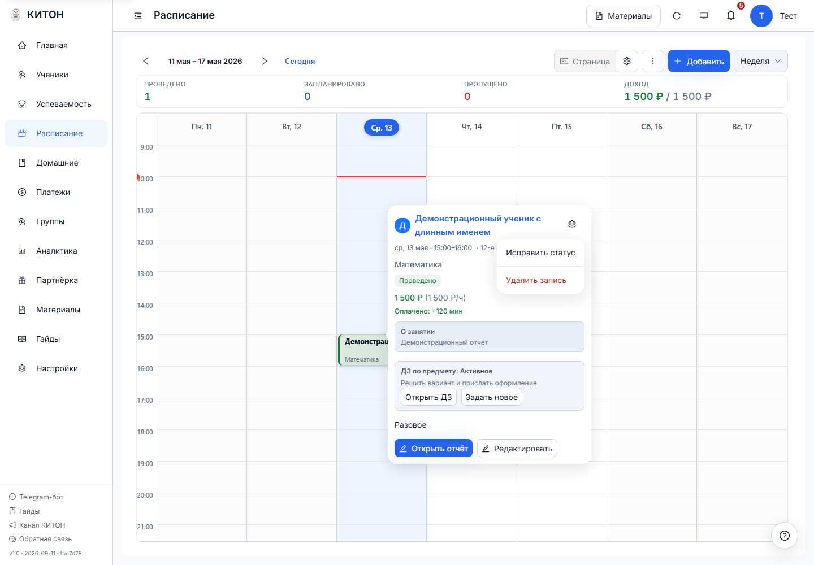
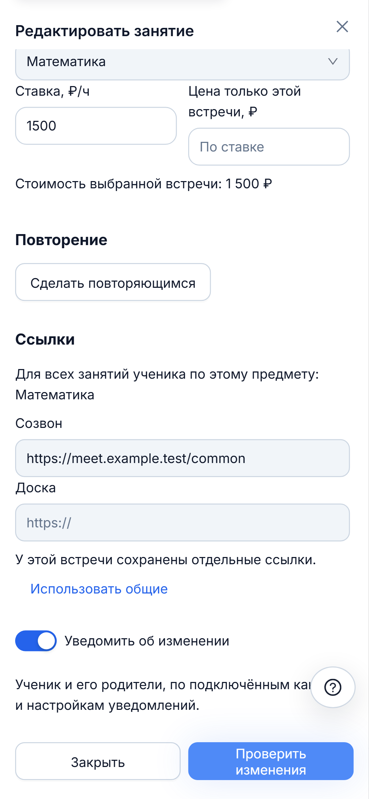
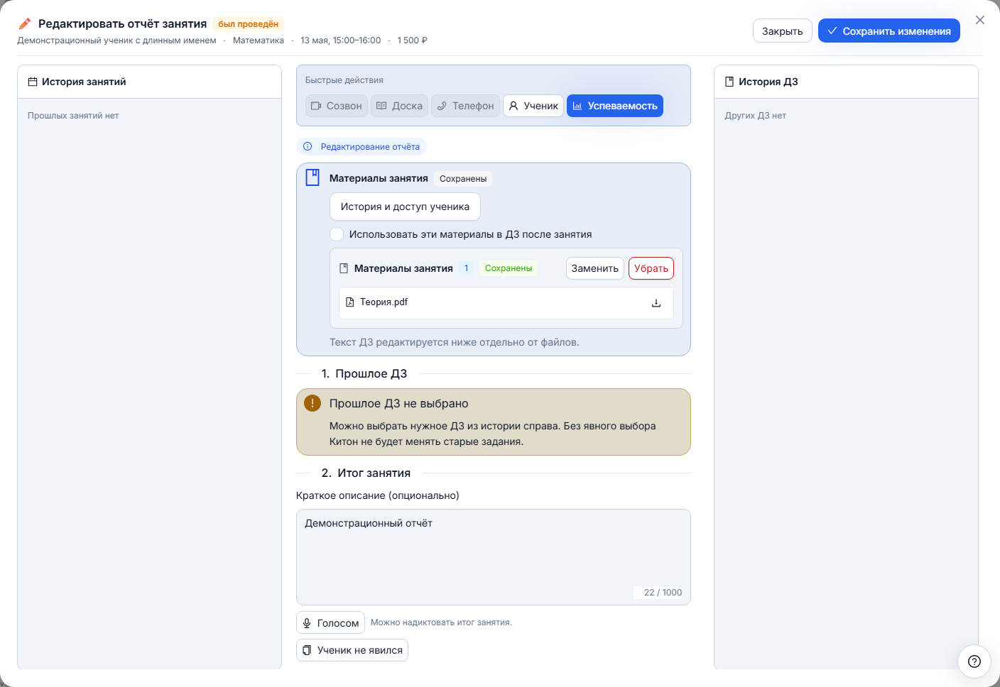
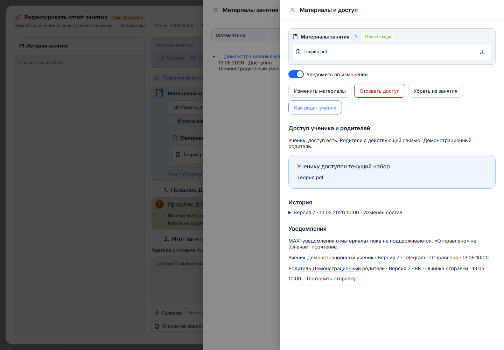
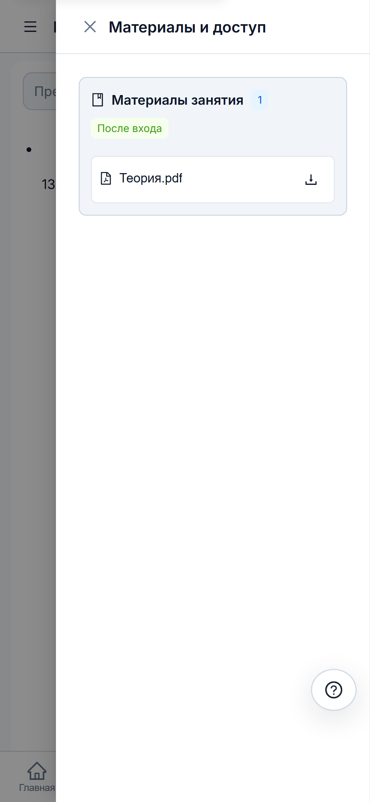

# Материалы занятия: файлы, история и доступ

Инструкция к обновлению карточки и материалов от 11 сентября 2026 года. Интерфейс на иллюстрациях проверяется на демонстрационных данных. Публикация обновления выполняется отдельно.

## Карточка и общие ссылки

Откройте занятие в расписании. Внизу находятся основное действие и «Редактировать». Шестерёнка справа сверху открывает «Действия занятия»: доступные действия зависят от статуса встречи. Например, у проведённого занятия доступны исправление статуса и удаление записи с подтверждением. Escape закрывает меню и возвращает фокус на шестерёнку.



В редакторе поля «Созвон» и «Доска» относятся ко всем занятиям ученика по выбранному предмету, а для группы - к группе. Правка времени, длительности или ставки не перезаписывает эти адреса. После смены предмета загружаются его общие ссылки.

Если раньше для встречи были сохранены отдельные ссылки, редактор сообщает об этом. «Использовать общие» удалит старое исключение после сохранения. Создавать новые исключения в этом окне нельзя.

{ width="360" }

## Как выдать материалы без ДЗ

1. Откройте отчёт занятия.
2. В блоке «Материалы занятия» выберите файлы из своей библиотеки или доступной базы знаний.
3. Проверьте состав. Оставьте уведомление включённым или отключите его для этого сохранения.
4. Сохраните отчёт. Создавать ДЗ для выдачи материалов не обязательно.

Вы также можете открыть карточку ученика, раздел «Материалы», выбрать предмет и нажать «Выдать материалы». Так можно выдать самостоятельный набор без привязки к встрече.

Физический файл загружается в библиотеку один раз. Версии наборов ссылаются на существующие файлы. Если файл из старого набора был перемещён в архив библиотеки, он остаётся в этом наборе и может быть сохранён в следующей версии.

## Уже сохранённый отчёт

Сначала загружаются его сохранённые материалы. Во время загрузки показывается индикатор, при ошибке - «Повторить». Ошибка загрузки не означает, что материалов нет, и блокирует сохранение отчёта до загрузки контекста.



У материалов три состояния:

| Ваше действие | Результат сохранения |
|---|---|
| Изменили только текст отчёта | Материалы остаются прежними |
| Выбрали другой состав | Создаётся новая версия материалов |
| Нажали «Убрать» | Удаляется связь набора с занятием |

До сохранения можно нажать «Отменить изменение материалов». Если закрыть отчёт с изменёнными материалами, появится выбор: продолжить редактирование или отбросить выбор. Ошибка сохранения оставляет выбранный состав в форме.

«Убрать» не отзывает уже выданный ученику доступ. Для этого используйте отдельное действие «Отозвать доступ» в сведениях о выдаче.

## Материалы занятия и материалы ДЗ

При создании ДЗ после занятия можно включить «Использовать эти материалы в ДЗ после занятия». У ДЗ появится свой набор с теми же файлами. Последующая правка материалов отчёта не заменяет этот набор ДЗ. Изменять его нужно из самого ДЗ или из соответствующей выдачи в разделе «Материалы».

Обычные вложения задания, загруженные в блок «Файлы задания», остаются отдельными вложениями. Они не становятся автоматически частью набора материалов.

## История и доступ

Из отчёта нажмите «История и доступ ученика». Из карточки ДЗ откройте «История материалов и доступ ученика». Общий список находится в карточке ученика, в разделе «Материалы»: есть фильтры по предмету и состоянию доступа, а длинный список разбит на страницы.

Откройте выдачу, чтобы увидеть текущие файлы, историю версий, автора и время изменения, связанных родителей и состояния уведомлений. Файл открывается нажатием на название; кнопка скачивания находится справа.



«Как видит ученик» проверяет действующее право ученика и показывает доступный ему состав. Эта проверка не входит в чужой аккаунт и не считается прочтением материалов.

Предыдущие версии доступны репетитору. По ссылке из уведомления ученик открывает актуальную версию. Ссылка на старую защищённую версию не даёт дополнительного права доступа. Если тот же набор остаётся действующим в другой выдаче, доступ через неё сохраняется.

Для старых привязок создаётся начальная запись. Она обозначена как перенос существующей привязки: прежняя история редактирования и отправок неизвестна и не восстанавливается предположениями. Указанное время такой записи - время переноса, а не доказательство первоначальной выдачи.

## Кто имеет доступ

Новые материалы открываются после входа. Право есть у получившего выдачу ученика и его родителей с действующей связью по соответствующему репетитору и предмету. Родительская связь проверяется при открытии и скачивании, а также перед отправкой уведомления.

В группе материалы выдаются выбранным присутствующим участникам при сохранении отчёта. Список получателей фиксируется. Позднее добавленный участник не получает прежние материалы автоматически. Выход ученика из группы сам по себе не отзывает ранее выданные материалы.

Ведущий группы управляет материалами только при наличии права выдавать ДЗ. Ограничение действует и при прямом обращении к файлу.

«Отозвать доступ» закрывает эту выдачу ученику и связанным родителям. «Вернуть доступ» открывает её снова. Перед отзывом или удалением связи показываются другие выдачи с теми же файлами и старые публичные наборы. Уже скачанные копии остаются у получателя.

## Старые публичные ссылки

Ссылки, созданные до обновления, продолжают открывать прежний состав без входа. В интерфейсе они помечены «Доступ по старой ссылке».

Новые выдачи и новые версии используют защищённые адреса. При использовании старого публичного набора в новой выдаче создаётся защищённый набор с теми же файлами. Старая ссылка при этом не меняется.

Если файл новой выдачи входит также в старый публичный набор, это показывается в сведениях о доступе. Отзыв персонального доступа не закрывает старую публичную ссылку. Поэтому интерфейс не называет такой отзыв полным удалением доступа к файлу.

## Что приходит в Telegram, ВК и MAX

| Канал | Материалы как набор | Где открываются файлы |
|---|---|---|
| Telegram | Сообщение об изменении со ссылкой на актуальную выдачу | На странице КИТОН после входа |
| ВК | Сообщение об изменении со ссылкой на актуальную выдачу | На странице КИТОН после входа |
| MAX | Уведомления об этих выдачах пока не поддерживаются | Доступные материалы можно открыть в кабинете |

Набор не рассылается отдельными файлами в сообщении об изменении. Это отличается от существующего механизма обычных вложений ДЗ.

Пример содержания уведомления, а не снимок мессенджера:

```text
Материалы занятия обновлены
Математика
[ссылка на актуальные материалы]
```

После перехода ученик входит в свой аккаунт, если ещё не вошёл. Затем он видит текущие файлы и может открыть или скачать их. Материалы также доступны через «Материалы занятий» в кабинете ученика или родителя.

{ width="360" }

## Как читать состояния отправки

| Состояние | Значение |
|---|---|
| В очереди | Изменение сохранено; отправка ожидается |
| Отправляется | Канал обрабатывает отправку |
| Отправлено | Канал подтвердил отправку; это не подтверждение прочтения |
| Ошибка отправки | Известно, что отправка не состоялась; доступен повтор |
| Результат отправки неизвестен | Ответ канала не позволяет установить результат; автоматического повтора нет, чтобы не послать дубликат |
| Не отправлялось | Уведомление отключено для операции, канал не подключён, запрещён настройками или получатель больше не имеет подходящей связи |

Состояния показываются отдельно для каждого получателя, версии и канала. «Повторить отправку» повторяет только неудачную отправку, а не уже успешные сообщения. Отключение переключателя уведомления не отменяет доступ к материалам.

При конфликте редактирования обновите данные, сравните текущий состав и сохраните выбранные изменения. Чужая версия не перезаписывается автоматически.
