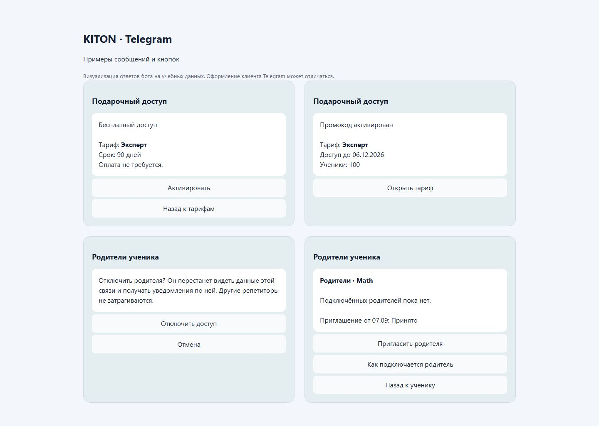

# Подключение родителей

Точка входа: карточка конкретного ученика → «Родители» на сайте или в Telegram.

1. Выберите нужную связь с учеником и предмет.
2. Нажмите «Пригласить родителя».
3. Скопируйте ссылку сайта либо Telegram и самостоятельно перешлите родителю.
4. После принятия проверьте подключённого родителя в карточке.

Результат: родитель видит данные ребёнка только у этого репетитора. Для второго родителя
создайте отдельное приглашение. [Как принять приглашение](../Parent/children.md).

Ссылка одноразовая и действует 14 дней. Она показывается при создании; восстановить её секрет
из истории нельзя. Если ссылка потеряна, создайте новую отдельным действием.

| Статус | Что делать |
| --- | --- |
| Ожидает принятия | Дождаться родителя или отозвать приглашение |
| Подключён | Доступ выдан, при необходимости отключить с подтверждением |
| Истёк срок | Создать новое приглашение |
| Отозван | Создать новое приглашение, если доступ снова нужен |

Отзыв непринятой ссылки и отключение уже выданного доступа - разные действия.
Отключение не меняет доступы других репетиторов и старые совместимые связи, которыми вы не управляете.
Ссылку ученика нельзя использовать как приглашение родителя.

## Примеры сообщений бота

Визуализация ответов на учебных данных. Оформление клиента Telegram может отличаться.

