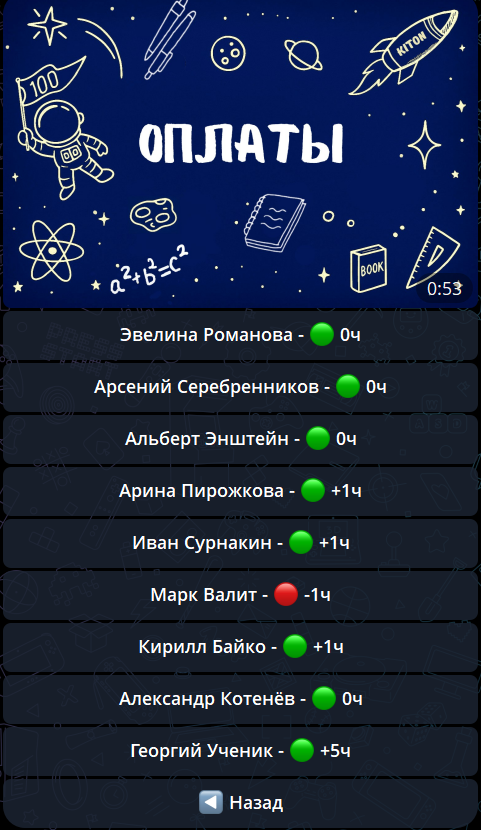
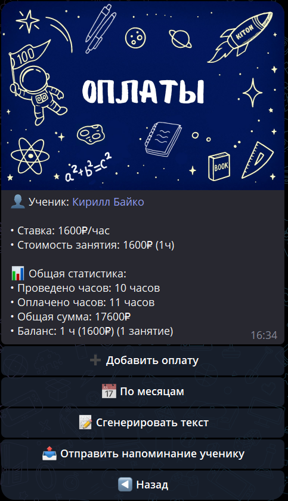

# Оплаты

Раздел **«Оплаты»** показывает список всех ваших учеников с их текущим балансом. Баланс отображается в часах для удобства.

---

## 🔍 Что означают значения?

### 🟢 Зелёный кружок

- **Положительный баланс** или **ноль**
- Ученик оплатил достаточно или больше, чем было проведено

### 🔴 Красный кружок

- **Отрицательный баланс** (долг)
- Ученик должен оплатить занятия, которые уже были проведены

### Формат отображения

Баланс показывается одновременно в рублях и часах:

- **`🟢 +3000₽ (+5ч)`** — запас оплаченных средств
- **`🟢 0₽ (0ч)`** — баланс равен нулю
- **`🔴 -1500₽ (-2ч)`** — долг, ученик должен доплатить

---

## ⚙️ Как рассчитывается баланс?

**Баланс = Оплаченные средства (₽) - Потраченные средства (₽)**

- **Оплаченные средства:** сумма всех платежей в рублях
- **Потраченные средства:** сумма всех завершённых занятий в рублях (по стоимости каждого занятия)

Учитываются только завершённые занятия. Начатые, но не завершённые занятия не списывают баланс.

---

## ➕ Как добавить оплату?

1. Нажмите на ученика в списке оплат.
2. Нажмите кнопку **«➕ Добавить оплату»**.
3. Введите сумму оплаты в рублях (только цифры, например: `3000`).
4. Система автоматически:
    - Сохранит оплату с текущей датой
    - Пересчитает баланс ученика
    - Отправит уведомление ученику и родителям

**Важно:** Оплата автоматически переводится в часы по текущей ставке за час для этого ученика.

---

## ✏️ Как редактировать оплату?

1. Нажмите на ученика в списке оплат.
2. Найдите нужную оплату в истории и нажмите на неё.
3. Нажмите кнопку **«✏️ Редактировать»**.
4. Выберите **«💰 Сумма»** для изменения суммы.
5. Введите новую сумму в рублях.
6. Система автоматически:
    - Обновит сумму оплаты
    - Пересчитает баланс ученика
    - Отправит уведомление об изменении

**Важно:** Можно изменить только сумму оплаты. Дата оплаты устанавливается автоматически при создании.

---

## 🗑️ Как удалить оплату?

1. Нажмите на ученика в списке оплат.
2. Найдите нужную оплату и нажмите на неё.
3. Нажмите кнопку **«🗑️ Удалить платеж»**.
4. Подтвердите удаление кнопкой **«✅ Да, удалить»**.

После удаления:

- Оплата удаляется из истории
- Баланс ученика пересчитывается
- Ученику и родителям отправляется уведомление

---

## 📅 Просмотр оплат по месяцам

Кнопка **«📅 По месяцам»** показывает детальную информацию по каждому месяцу:

- **Список всех занятий** с их статусами (📅 Запланировано, ✅ Проведено, ❌ Отменено)
- **Дату и стоимость** каждого занятия
- **Оплаты за месяц** (можно нажать для просмотра)
- **Баланс на начало месяца** и **долг с предыдущего месяца** (если есть)
- **Сумму к оплате** за месяц и **остаток баланса** (если есть)

Используйте кнопки **◀️** и **▶️** для навигации между месяцами.

---

## 📝 Сгенерировать текст напоминания

Кнопка **«📝 Сгенерировать текст»** создаёт готовый текст напоминания об оплате для текущего месяца:

- **Статистику за месяц:** проведено, осталось, всего занятий
- **Оплачено в этом месяце** (в рублях)
- **Баланс или долг** с суммой к оплате

Скопируйте текст и отправьте ученику или родителю вручную.

---

## 📤 Отправить напоминание ученику

Кнопка **«📤 Отправить напоминание ученику»** автоматически отправляет напоминание через Telegram:

- **Ученику** (если есть Telegram)
- **Родителям** (если подключены)

Если есть долг — сообщение покажет сумму долга. Если долга нет — напомнит пополнить баланс.

Отправка происходит только если у ученика или родителей есть Telegram ID.

---

## ⚠️ Важно знать

1. Без указанной ставки за час баланс показывается как `0ч`.
2. При нажатии на ученика открывается детальная история оплат и занятий.
3. Можно добавить оплату, изменить ставку или посмотреть статистику.
