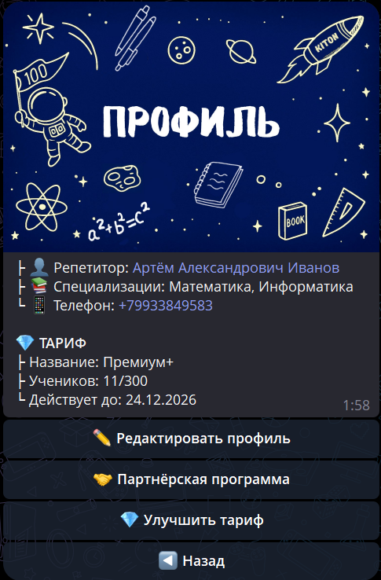

# Профиль

Раздел **«Профиль»** содержит ваши основные данные как репетитора и предоставляет доступ к важным функциям управления аккаунтом.

---

## 📋 Отображаемая информация

В профиле отображается:

- **👤 Репетитор** — ваше полное имя
- **📚 Специализации** — список предметов, которые вы преподаёте
- **📱 Телефон** — контактный номер телефона
- **💎 Тариф** — информация о текущем тарифе, дате окончания подписки и доступных функциях

---

## ✏️ Редактирование профиля

Нажмите **«✏️ Редактировать профиль»**, чтобы изменить:

- **Имя, Фамилия, Отчество** — только кириллица, с большой буквы
- **Специализация** — список предметов (можно несколько, необходимо указать через запятую)
- **Телефон** — формат +7XXXXXXXXXX

Система проверяет формат данных при сохранении. Если формат неверный, изменения не сохранятся.

---

## 🤝 Партнёрская программа

Зарабатывайте на приглашении других репетиторов — получайте **50%** комиссии с каждой оплаты тарифа вашими рефералами.

Подробнее → [Партнёрская программа](partner-program.md)

---

## 💎 Управление тарифами

Управляйте подпиской и расширяйте функционал платформы. Три тарифа: **Базовый** (бесплатно, 3 ученика), **Репетитор** (от 112 ₽/мес, 20 учеников) и **Эксперт** (от 225 ₽/мес, безлимит).

Подробнее → [Тарифы](tariffs.md)

---

## 💎 Тарифные планы

| Функционал / Параметры | 🆓 Базовый | 📘 Репетитор | 💎 Эксперт |
| :--- | :---: | :---: | :---: |
| **Макс. количество учеников** | 3 | 20 | ∞ |
| **Расписание и напоминания** | ✅ | ✅ | ✅ |
| **Уведомления о занятиях** | ✅ | ✅ | ✅ |
| **Справка и инструкции** | ✅ | ✅ | ✅ |
| **Балльная система (Газики)** | ✅ | ✅ | ✅ |
| **Прогресс по занятиям** | ✅ | ✅ | ✅ |
| **Детальные отчёты и аналитика** | ❌ | ✅ | ✅ |
| **Экспорт данных в Excel** ¹ | ❌ | ✅ | ✅ |
| **Домашние задания с файлами** | ❌ | ✅ | ✅ |
| **Групповые занятия** | ❌ | ❌ | ✅ |
| **Стоимость (за 12 месяцев)** | **Бесплатно** | **1 349 ₽** | **2 699 ₽** |

Подробнее о тарифах и ценах → [Тарифы](tariffs.md)

---

## ⚠️ Важно знать

- Профиль виден ученикам и родителям — данные должны быть актуальны
- Тариф влияет на функционал — некоторые функции доступны только на определённых тарифах. Кнопка экспорта в XLSX видна на всех тарифах, но при нажатии на Базовом будет предложено повысить тариф ¹
- Партнёрская программа активна сразу после регистрации

💡 **Рекомендуется заполнить профиль полностью** — это повышает доверие и упрощает коммуникацию.