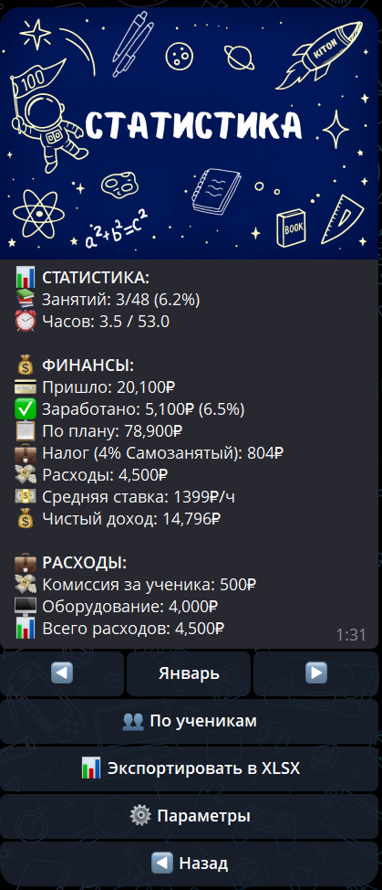

# Статистика

Раздел **«Статистика»** показывает общую статистику репетитора за выбранный месяц: количество занятий, доходы, налоги и расходы.

---

## 🔍 Общая статистика за месяц

- 📚 **Занятий** — соотношение проведённых и запланированных занятий с процентом выполнения плана
- ⏰ **Часов** — соотношение проведённых и запланированных часов

### 💰 Финансы

- 💳 **Пришло** — поступления на счёт за месяц
- ✅ **Заработано** — доход по проведённым занятиям
- 📋 **По плану** — доход по запланированным занятиям
- 💼 **Налог** — налог от суммы «Пришло»
- 💸 **Расходы** — общая сумма расходов за месяц
- 💵 **Средняя ставка** — рассчитывается от чистого дохода от занятий
- 💰 **Чистый доход** — итоговый доход после вычета налогов и расходов

---

## 👥 Просмотр статистики по ученикам

Кнопка **«👥 По ученикам»** открывает список всех учеников для просмотра детальной статистики:

1. Нажмите кнопку **«👥 По ученикам»**.
2. Выберите ученика из списка.
3. Вы увидите:
    - **Количество занятий** за месяц (проведено, запланировано, пропущено)
    - **Доходы** по этому ученику
    - **Процент выполнения плана**
    - **Статистику по предметам** (если у ученика несколько предметов)

При нажатии на ученика можно выбрать конкретный предмет для просмотра статистики по нему отдельно.

---

## 📊 Экспорт статистики в Excel

Кнопка **«📊 Экспортировать в XLSX»** формирует Excel-файл со всей статистикой:

1. Нажмите кнопку **«📊 Экспортировать в XLSX»**.
2. Система сформирует файл и отправит его вам в чат.

**Важно:** Экспорт в Excel доступен на тарифе **Репетитор** и выше. Если кнопка недоступна, повысьте тариф в разделе **«👤 Профиль → Тарифы»**.

Подробнее о содержимом файла — в разделе [Excel-статистика](statistics/excel-statistics.md).

---

## ⚙️ Параметры

Кнопка **«⚙️ Параметры»** открывает настройки налогов и расходов.

### 💼 Настройка налогов

Нажмите **«⚙️ Налоговые настройки»** и выберите вариант:

- **4% Самозанятый** — стандартная ставка для самозанятых
- **💼 Внести свой налог** — произвольный процент от 1% до 60%

Налог рассчитывается автоматически от суммы «Пришло» по установленному проценту.

**Ручной ввод за конкретный месяц:** Если в каком-то месяце сумма налога отличается, нажмите **«💼 Ввести налог за [месяц]»** — откроется сетка из 12 месяцев. Выберите нужный и введите сумму. Ручной ввод перекрывает процентный расчёт только для выбранного месяца.

### 📋 Управление расходами

Нажмите **«📋 Расходы»** для просмотра и добавления расходов за текущий месяц.

**Добавление расхода:**

1. Нажмите **«➕ Добавление расхода»**
2. Выберите категорию:
    - 💼 **Комиссии** — комиссии за учеников, платформы
    - 🛠️ **Оборудование** — техника, мебель, инструменты
    - 🧾 **Расходники** — учебники, материалы, канцелярия
    - 📝 **Прочие расходы** — введите своё название
3. Введите сумму в рублях

Расход автоматически привязывается к текущему месяцу.

**Просмотр и редактирование:**

В списке расходов за месяц видно: категорию, название, дату и сумму. Общая сумма отображается внизу. Нажмите на расход, чтобы изменить категорию, сумму или удалить его.

Расходы вычитаются из дохода при расчёте **«💰 Чистый доход»** в общей статистике.

---

## ⚠️ Важно знать

1. Статистика рассчитывается на основе запланированных и проведённых занятий.
2. Доходы считаются по стоимости занятий или по ставке и длительности.
3. Процент выполнения плана показывает соотношение проведённых и запланированных занятий.
4. Для экспорта в Excel требуется тариф **Репетитор** или выше.