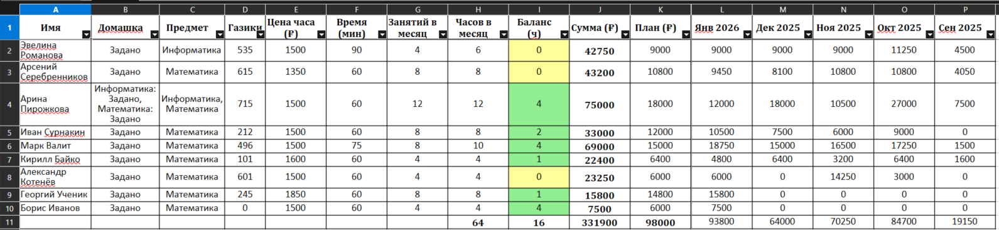
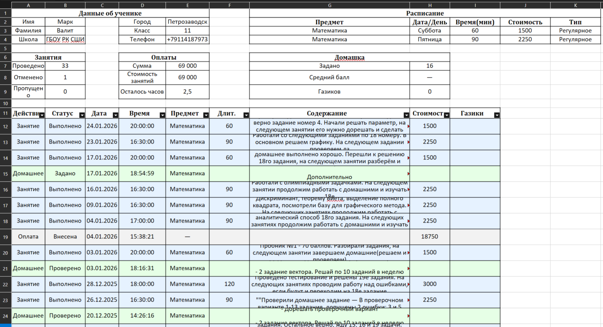

# Excel-статистика

Детальная статистика по всем ученикам за последние 24 месяца в Excel-формате.

---

## 📊 Что в файле?

**Основные данные по каждому ученику:**

- Имя, предмет, статус домашнего задания
- Газики, цена часа, длительность урока
- Количество занятий и часов в месяц (автоматический расчёт)
- Баланс в часах (цветовая индикация)
- Общий доход и план (автоматический расчёт)

Формируется **одна общая таблица** со всеми учениками и **детальные данные по каждому ученику**.

---

## 💡 Зачем это нужно?

- **Финансовый контроль** — видите доходы, сравниваете план и факт, контролируете балансы
- **Анализ эффективности** — находите самых прибыльных учеников, оцениваете загруженность
- **Работа с учениками** — отслеживаете выполнение ДЗ, мотивацию, прогресс
- **Отчётность** — экспорт данных для графиков, документов, анализа трендов

---

**Важно:** Экспорт доступен на тарифе **Репетитор** и выше.