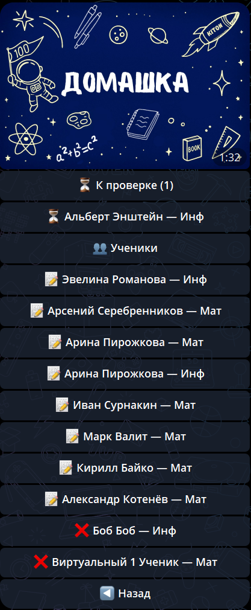
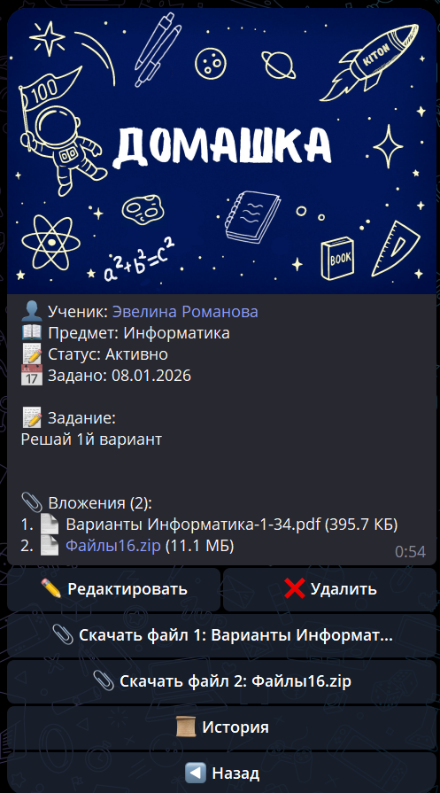

# Домашние задания (для Репетитора)

Раздел **«Домашние задания»** — это основной инструмент управления учебным процессом. Здесь вы можете создавать задания, контролировать их выполнение, проверять решения и мотивировать учеников с помощью системы баллов «Газики».

## 📋 Обзор раздела

При переходе в раздел из главного меню вы видите список всех своих учеников. Рядом с именами отображаются индикаторы, которые помогают быстро сориентироваться в текущей ситуации:

### Статусы и индикаторы
- 📝 — **Задано**: у ученика есть активное задание, которое он еще не выполнил.
- ⏳ — **Сдано**: ученик отправил решение, задание ожидает вашей проверки.
- ✅ — **Проверено**: последнее задание проверено, можно задавать новое.
- ❌ — **Нет заданий**: у ученика (обычно виртуального) на данный момент нет назначенных задач.

---

## 🚀 Создание домашнего задания

Чтобы назначить задание ученику, выполните следующие шаги:

1. В главном меню нажмите кнопку **📚 Домашние задания**.
2. Выберите нужного ученика из списка.
3. Нажмите кнопку **➕ Создать домашнее задание**.
4. **Введите текст задания**: вы можете отправить одно или несколько сообщений подряд — бот объединит их в одну карточку задания.
5. **Прикрепите файлы**: при необходимости отправьте документы (PDF, Word), изображения или архивы.
6. **Подтвердите создание**: после того как вы нажмете кнопку подтверждения, задание мгновенно отправится ученику и его родителям (если они подключены к системе).

> ⚠️ **Важное ограничение**: У одного ученика по одному предмету может быть только **одно активное задание**. Если текущее задание имеет статус «Задано» или «Ожидает проверки», кнопка создания нового будет заблокирована. Чтобы задать новое, нужно сначала завершить (проверить или удалить) текущее.

---

## 🔍 Проверка и оценивание

Когда ученик нажимает у себя кнопку «Завершить» при сдаче работы, вы получаете уведомление, а статус задания меняется на **⏳ Сдано**.

### Как проверить задание:
1. Перейдите в карточку задания ученика.
2. Ознакомьтесь с присланным решением (текст, фото, файлы).
3. Нажмите кнопку **✅ Проверить**.
4. **Выставьте оценку**: выберите количество баллов **«Газики» (от 0 до 50)**.
5. **Добавьте комментарий**: вы можете написать текстовый отзыв о работе, разобрать ошибки или похвалить.

После подтверждения проверки ученику и родителю придет уведомление с вашей оценкой, комментарием и количеством начисленных Газиков.

---

## 🛠 Действия с заданием

В карточке активного задания доступны следующие функции:

- **✏️ Редактировать**: позволяет изменить текст уже заданного задания или добавить/удалить файлы. При сохранении изменений ученик получит уведомление об обновлении задания.
- **❌ Удалить**: полностью удаляет текущее задание. Это может понадобиться, если вы создали его по ошибке. Удаленное задание перемещается в архив.
- **🔄 Перепроверить**: если задание уже было проверено, но вы решили изменить оценку или дополнить комментарий, вы можете сделать это через данную кнопку.
- **📜 История**: открывает список всех когда-либо выполненных заданий этим учеником по выбранному предмету. Позволяет отслеживать динамику и возвращаться к старым темам.

---

## 🔔 Уведомления и автоматизация

Система KITON берет на себя информирование всех участников процесса:
- **Ученик** получает уведомление, когда задание создано, отредактировано или проверено.
- **Родители** получают аналогичные уведомления, что позволяет им контролировать нагрузку ребенка, не заглядывая в его телефон.
- **Репетитор** получает уведомление, как только ученик приступает к выполнению или сдает работу.

---

## 💡 Советы для эффективной работы
- **Используйте файлы**: прикрепляйте PDF-задания или фотографии из учебников, чтобы ученику не приходилось искать их самостоятельно.
- **Не забывайте про Газики**: даже небольшое количество баллов за среднюю работу мотивирует ученика не бросать выполнение заданий в будущем.
- **Пишите комментарии**: краткий разбор ошибок в боте экономит время на самом занятии, позволяя сразу перейти к сложным моментам.