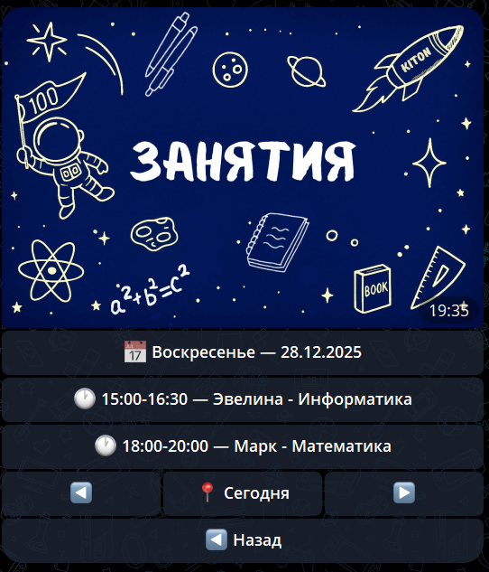
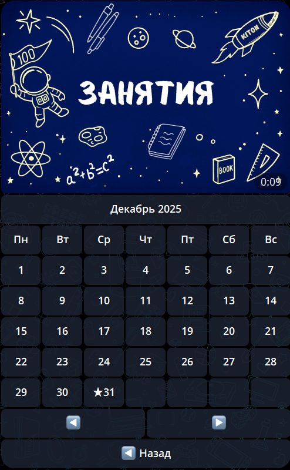
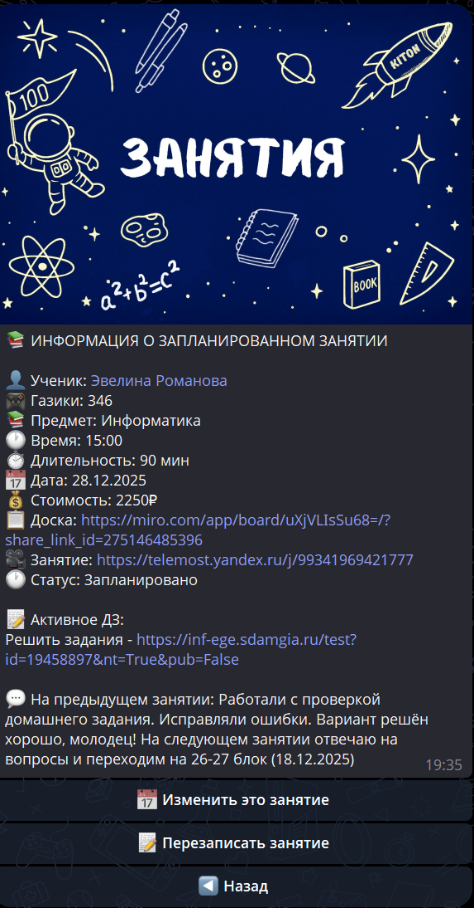

# Занятия

Раздел **«Занятия»** — ваш календарь и центр управления уроками. Здесь собрана вся информация: кто, когда и по какому предмету занимается.

---

## 📅 Календарь занятий

При переходе в раздел вы видите:

- **Кнопка с сегодняшней датой** — нажмите, чтобы открыть календарь
- **Карточки занятий** на текущую дату (запланированные 🕐, начавшиеся ▶️,  проведённые ✅, пропущенные ⏭️, отменённые ❌)
- **Кнопки навигации** — переключение между днями

По нажатию на кнопку с датой открывается календарь. Нажатие на любой день показывает список занятий на выбранную дату.

---

## 📋 Карточка занятия

Каждое занятие отображается карточкой с основной информацией.

### Статусы занятий

| Эмодзи | Статус | Описание |
| :---: | :--- | :--- |
| 🕐 | Запланировано | Занятие ещё не началось |
| ▶️ | Идёт | Занятие началось, идёт прямо сейчас |
| ✅ | Проведено | Занятие завершено, отчёт заполнен |
| ⏭️ | Пропущено | Занятие не состоялось (пропуск) |
| ❌ | Отменено | Занятие отменено |

### Типы занятий

| Обозначение | Тип | Описание |
| :---: | :--- | :--- |
| 🔄 | Регулярное | Повторяется каждую неделю в один и тот же день |
| 1️⃣ | Разовое | Одно занятие на конкретную дату |

---

## ➕ Создание занятия

Создать занятие можно из карточки [ученика](Ученики.md) (кнопка **➕ Добавить занятие**):

1. Выберите предмет (если у ученика несколько предметов).
2. Выберите тип: **🔄 Регулярное** или **1️⃣ Разовое**.
3. Укажите параметры:
    - **Для регулярного:** день недели, время начала, длительность (30–180 минут)
    - **Для разового:** конкретную дату, время начала, длительность
4. Занятие появится в календаре и в карточке ученика.

---

## 🔧 Исключения (для регулярных занятий 🔄)

Исключения позволяют точечно изменить одно занятие в серии, не затрагивая остальные. Нажмите на регулярное занятие, потом на кнопку "Изменить это занятие", чтобы вывести меню редактирования именно данного занятия:

| Действие | Описание |
| :--- | :--- |
| **Отменить** | Убрать занятие на текущей дате (не состоится) |
| **Перенести** | Перенести на другую дату или время (только для этой даты) |
| **Изменить время** | Изменить время начала и/или длительность только для этой даты |
| **Изменить стоимость** | Изменить цену занятия только для этой даты |

**💡Пример:** У вас регулярное занятие каждый понедельник в 18:00. Можно отменить только один конкретный понедельник или перенести его на вторник — остальные понедельники останутся без изменений.

Все изменения применяются только к выбранной дате и не влияют на другие занятия в серии.

---

## 📝 Заполнение отчёта (Завершение)

После того как время урока истекло, бот пришлет уведомление **«⏰ Занятие завершилось!»** с кнопкой **📝 Заполнить отчёт**. Процесс состоит из нескольких шагов:

### 1. Проверка домашнего задания
Если ученику было задано ДЗ, бот покажет его текст и предложит выбрать:
* **✅ ДЗ выполнено:** Переход к оценке.
* **❌ ДЗ не выполнено:** Задание останется активным, баллы не начисляются.

### 2. Оценка (Газики)
Если ДЗ выполнено, укажите количество баллов от 0 до 50.

### 3. Резюме занятия
Напишите кратко, что успели сделать и какие успехи у ученика.
* **Для кого:** Этот текст увидят и ученик, и родитель.
* **Подсказка:** Бот напомнит вам содержание предыдущего занятия, чтобы было легче проследить динамику.

### 4. Новое домашнее задание
Вы можете задать новую работу прямо в отчёте:
* **Текст + Файлы:** Отправьте текстовое описание и прикрепите до 20 файлов (фото, PDF, аудио).
* **📋 Задать такое же домашнее:** Удобная функция копирования предыдущего задания (текст и файлы) в один клик.
* **❌ Не задавать:** Если на следующий раз работы нет.

---

### ✅ Подтверждение и отправка
На финальном экране вы увидите предпросмотр всего отчёта.

* **Проверка баланса:** Если у ученика есть активная награда за Газики (скидка или бесплатный урок), она будет применена к этому занятию автоматически, и вы увидите пересчитанную стоимость.
* **Действия:** Вы можете **✅ Отправить отчёт**, **✏️ Изменить** любой пункт или **❌ Отменить** заполнение (занятие останется пропущенным)

### 💡 Важные особенности

* **Списание баланса:** Деньги с баланса ученика списываются только в момент нажатия кнопки **«Отправить отчёт»**.
* **Пропущенные занятия:** Если вы не заполнили отчёт в течение 24 часов, занятие автоматически перейдёт в статус **«Пропущено»**. Его можно будет «перезаписать» позже через раздел **Пропущенные занятия** на главном меню.
* **История:** Все ваши отчёты и оценки сохраняются в подразделе **📊 Успеваемость** в карточке ученика.

---

## 🔔 Уведомления

Система автоматически отправляет уведомления:

- **Перед занятием** — напоминание репетитору и ученику
- **После проведения** — уведомление о завершении и назначенном ДЗ
- **При отмене** — уведомление об отмене занятия

---

## ⚠️ Важно знать

1. Регулярные занятия создаются на определённый день недели и повторяются каждую неделю.
2. Для точечных изменений в регулярном расписании используйте исключения — это не затронет остальные занятия.
3. Отчёт о проведении занятия влияет на расчёт статистики и баланса ученика.
4. Ссылки на созвон и доску (если настроены в карточке ученика) доступны прямо из карточки занятия.
