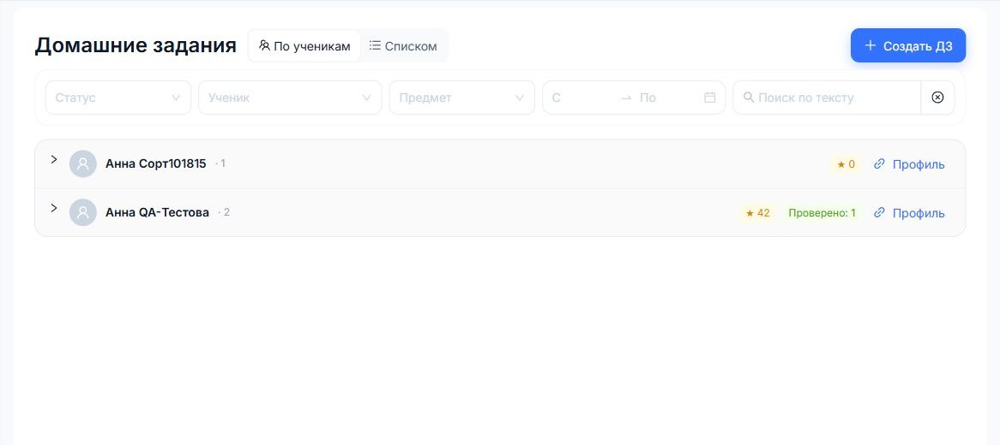

# Домашние задания

Домашнее задание в КИТОН связано с учеником, предметом и занятием. У задания есть текст, файлы, статус и Газики.

## Задать ДЗ после урока

1. Откройте занятие в расписании.
2. Заполните блок "Что прошли на занятии".
3. Включите "Задать новое ДЗ".
4. Напишите задание.
5. Прикрепите файлы или перенесите файлы из прошлого ДЗ.
6. Сохраните изменения.

## Активное предыдущее ДЗ

Если у ученика уже есть активное ДЗ, новое задание нельзя выдать, пока старое не закрыто. Если вы ставите оценку предыдущему ДЗ в отчете, оно закрывается, и новое ДЗ можно выдать в том же сохранении.

## Редактирование активного ДЗ

Если ученик сказал, что уже делал это задание, откройте активное ДЗ, измените текст или файлы и отправьте обновление. Так ученик увидит актуальную версию.

## Файлы

Файлы можно:

- загрузить с компьютера;
- взять из предыдущего ДЗ;
- скачать для проверки;
- прикрепить к новому ДЗ по одному файлу.
