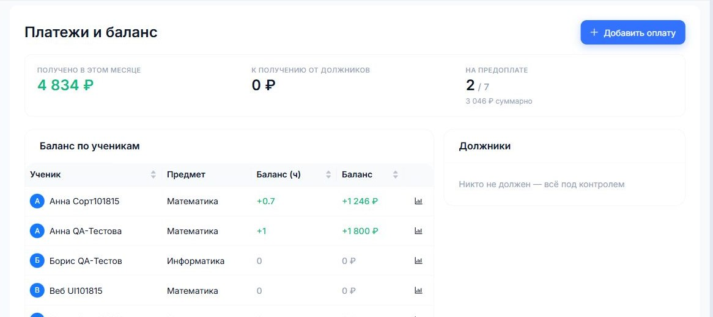
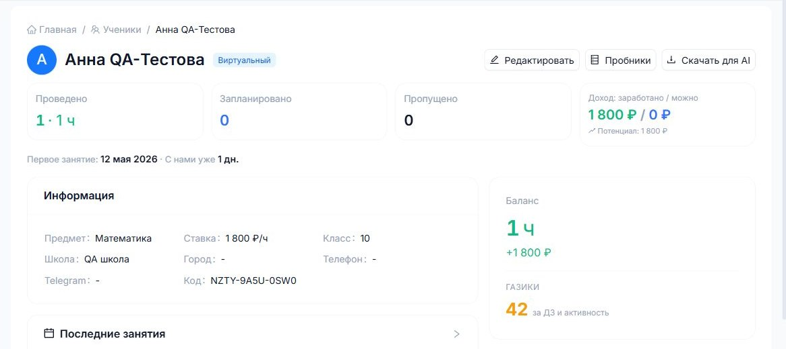

# Оплаты и баланс

КИТОН разделяет несколько финансовых смыслов. Это важно, чтобы не путать реальный приход денег и стоимость проведенных занятий.

## Термины

- **Получено** - реальные платежи, которые уже внесены в систему.
- **Начислено** - стоимость проведенных занятий.
- **Прогноз** - проведенные занятия плюс будущие запланированные.
- **Долг** - ученик получил услуг больше, чем оплатил.
- **Остаток** - ученик оплатил больше, чем уже проведено.
- **Чистыми** - получено минус расходы и налоги.

## Добавить платеж

Откройте "Платежи", выберите ученика, сумму, дату и комментарий. После сохранения баланс пересчитается автоматически.

## Баланс ученика

В карточке ученика видно, сколько проведено, сколько оплачено и есть ли долг.

