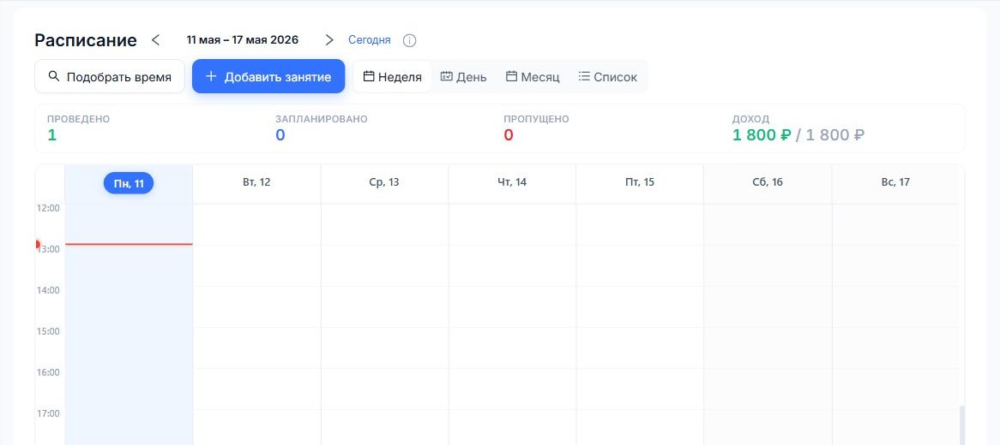

# Расписание

Расписание показывает разовые, регулярные, перенесенные, отмененные, проведенные и пропущенные занятия.

## Создать занятие

1. Нажмите "Добавить занятие".
2. Выберите ученика.
3. Если предметов несколько, выберите предмет.
4. Укажите дату, время и длительность.
5. Сохраните.

## Провести занятие

Нажмите на занятие и откройте отчет. Внутри можно:

- оценить домашнее задание;
- написать, что прошли;
- задать новое ДЗ;
- приложить файлы;
- отправить уведомление ученику и родителю.

## Перенос и отмена

Перенос меняет конкретное занятие или серию занятий. Отмена нужна, если урок не состоится и не должен попасть в долг как проведенный.

