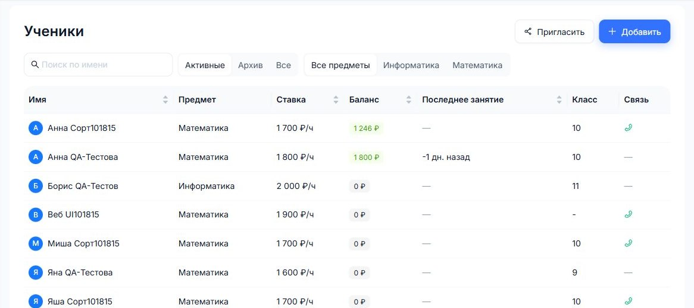

# Первый результат в веб-сервисе

Этот раздел про основной кабинет репетитора. Telegram-бот дополняет его уведомлениями, но главный контроль лучше вести здесь.

## 1. Добавьте ученика

Откройте "Ученики" и нажмите "Добавить ученика". Укажите имя, предмет, ставку, длительность занятия и ссылки, которые будете использовать на уроках.

## 2. Создайте занятие

Откройте "Расписание" и добавьте разовое или регулярное занятие. Если у ученика несколько предметов, выберите конкретный предмет.

## 3. Проведите урок

После занятия заполните отчет: что прошли, оцените предыдущее ДЗ, задайте новое ДЗ и при необходимости отправьте уведомление.

## 4. Добавьте оплату

Когда ученик оплатил занятие или пакет, добавьте платеж. КИТОН пересчитает баланс и покажет долг или остаток.

## 5. Проверьте прогресс

Если ученик готовится к экзамену, используйте раздел "Прогресс": пробники, задания, первичные и вторичные баллы.
