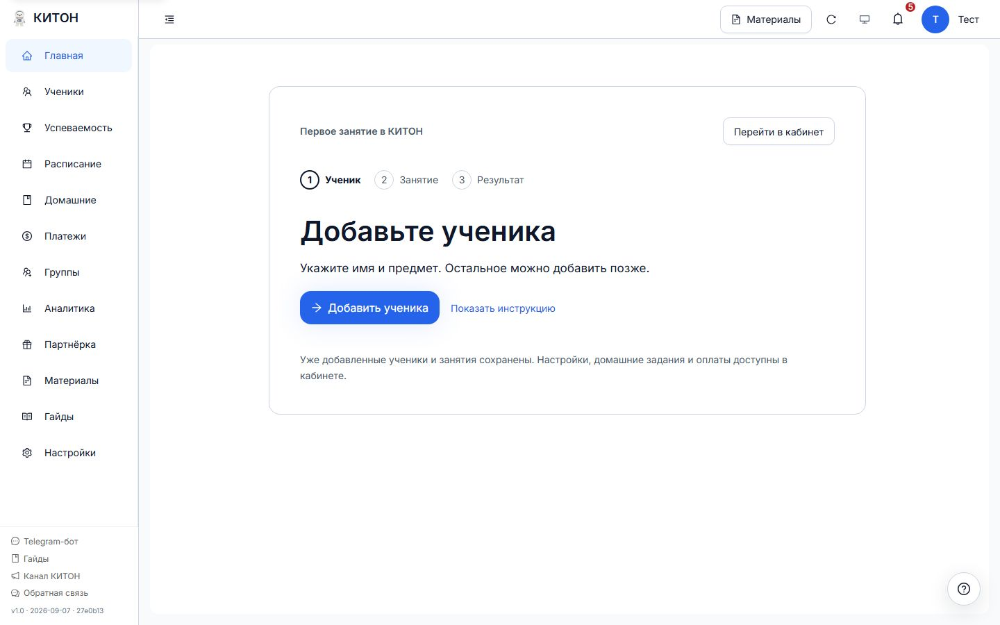
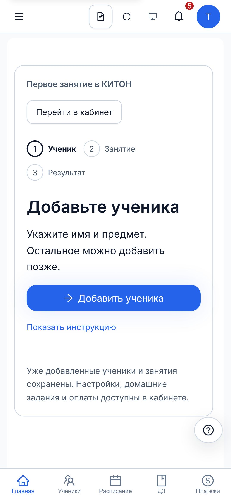

# Первый запуск репетитора

Точка входа: [главная KITON](https://kiton.pw/tutor). Сценарий проверяется по сохранённым данным.

1. Добавьте активного ученика. Достаточно имени и предмета; дополнительные поля раскрываются отдельно.
2. Создайте первое занятие. По умолчанию оно разовое. После сохранения можно настроить повторение.
3. После урока откройте занятие и сохраните фактический результат «Проведено».

Результат: открывается обычный кабинет. Уже добавленных учеников и занятия не нужно создавать заново.
ДЗ, оплата, приглашение родителя и подарочный код не обязательны для завершения запуска.

| Состояние | Действие |
| --- | --- |
| Нет активного ученика | Добавить ученика |
| Есть ученик без занятий | Создать занятие |
| Есть будущее занятие | Открыть ближайшее занятие |
| Есть прошедшее занятие без результата | Отметить результат |
| Только отмены или пропуски | Создать следующее занятие |
| Есть проведённое занятие | Обычный кабинет |

Кнопка «Перейти в кабинет» сохраняет выбор. В [помощи сайта](https://kiton.pw/tutor/help)
можно нажать «Вернуть быстрый старт». История занятий при этом сохраняется.

При ошибке API проверьте выделенное поле и повторите сохранение. Черновик первого ученика и занятия
сохраняется в текущей сессии отдельно для аккаунта, очищается после сохранения или выхода.

[Ученики](students.md) · [Занятия](schedule.md) · [Родители](../Tutor/parents.md) · [Промокоды](../Tutor/tariffs.md)

