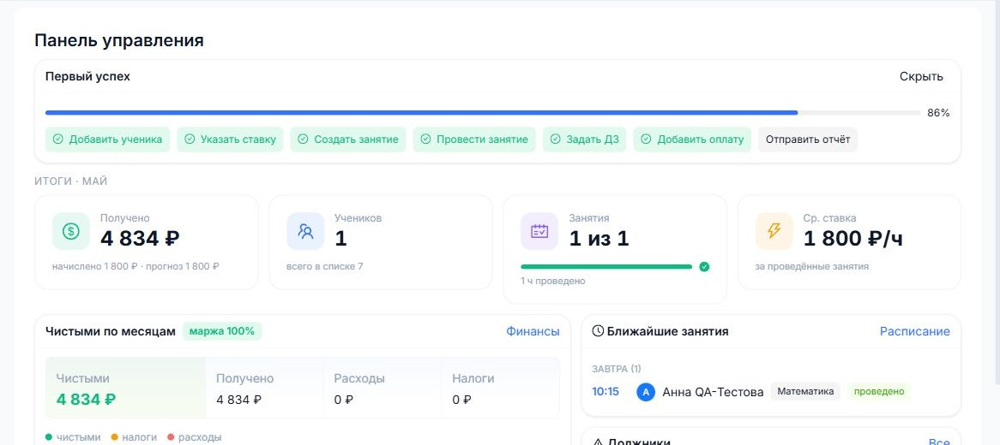

# Быстрый старт

Цель первого дня - не изучить все кнопки, а провести полный рабочий путь: ученик -> занятие -> ДЗ -> оплата -> отчет.

## Маршрут первого результата

1. Зарегистрируйтесь как репетитор.
2. Добавьте первого ученика.
3. Укажите предмет и ставку.
4. Создайте занятие в расписании.
5. После урока заполните отчет.
6. Задайте домашнее задание.
7. Добавьте оплату или отметьте долг.
8. Подключите Telegram, чтобы ученик и родитель получали уведомления.

## Что можно пропустить в первый день

- Партнерку.
- Группы.
- Подробную аналитику.
- Пробники, если ученик еще не пишет экзаменационные варианты.
- Тонкие настройки уведомлений.

## Что проверить перед реальным учеником

- Правильно ли указаны предмет и ставка.
- Есть ли ссылки на созвон и доску в карточке ученика.
- Умеете ли вы создать и провести занятие.
- Понятно ли, как задать ДЗ и приложить файл.
- Понимаете ли разницу между "Получено", "Начислено" и "Прогноз".
