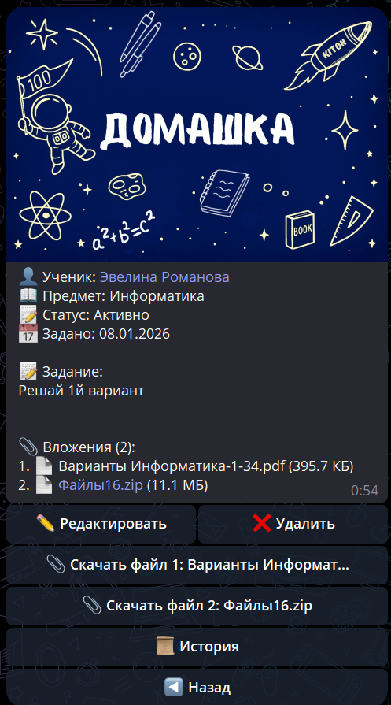

# Домашние задания в Telegram

Ученик может получить ДЗ в Telegram, скачать файлы и отправить выполненную работу обратно. Сдача единая для сайта, Telegram и VK.

В списке видно, какие задания активны, какие ждут проверки, а какие уже проверены.

## Получение ДЗ

Когда репетитор задает ДЗ и включает уведомление, бот отправляет ученику текст задания и файлы.

## Сдача ДЗ

Ученик отправляет текст и файлы в бот, затем нажимает **«Отправить на проверку»**. До проверки решение можно обновить. После сдачи репетитор видит ту же работу в web-кабинете и может поставить Газики.

Telegram напрямую принимает файлы до 20 МБ. Для большего файла бот даёт защищённую ссылку на web-загрузку до 200 МБ.

В групповом ДЗ бот показывает общее задание группы и только личную сдачу текущего ученика.

## Если ДЗ нужно заменить

Если репетитор заменил активное ДЗ, ученику можно отправить новое уведомление с актуальным заданием и файлами. Старое сообщение в Telegram лучше считать неактуальным.
